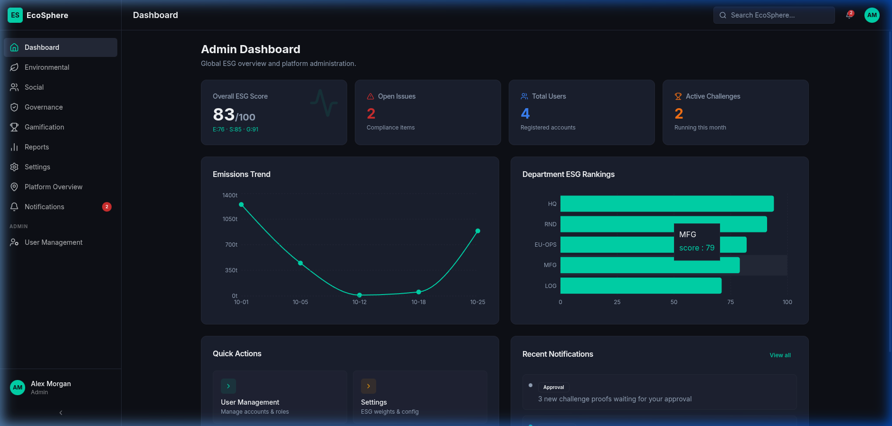
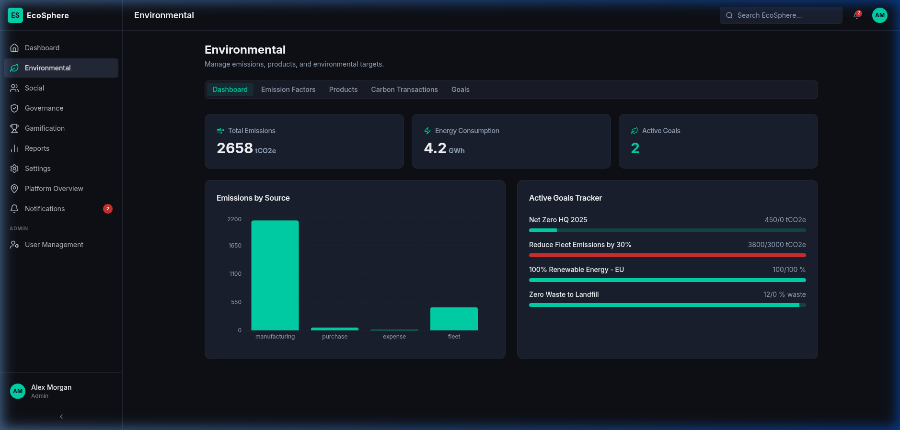
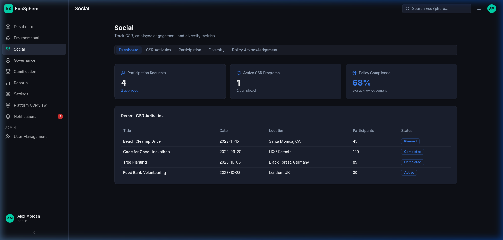
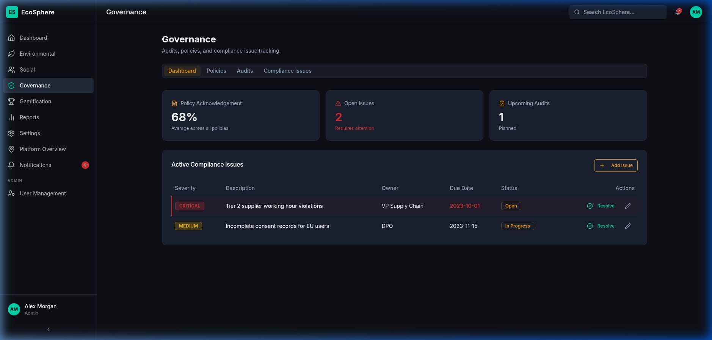
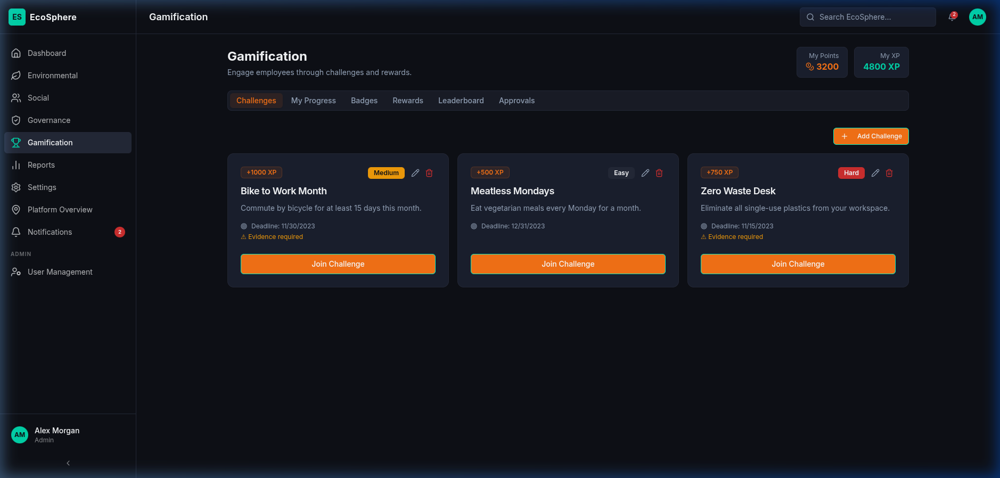

# 🌍 EcoSphere: Enterprise ESG Management Platform

<p align="center">
  
  
  
  
  
  
  
  
</p>

---

## 🏆 The Team
We are a team of 4 dedicated developers competing to build state-of-the-art ESG management tools:
* 👑 **Vrund Patel** — Team Leader
* 💻 **Meet Soni** — Developer
* 🎨 **Hemil Hansora** — Developer
* 📊 **Kaustav Das** — Developer

---

## 📖 Project Overview
**EcoSphere** is a premium, full-stack enterprise Environmental, Social, and Governance (ESG) Management platform designed to track sustainability KPIs, engage employees through gamification, manage compliance audits, and calculate real-time carbon footprints.

---

## ✨ Features

### 1. 🛡️ Role-Based Dynamic Dashboards
* Personalized interface views customized for **Admin**, **Manager**, and **Employee** roles.
* Key performance metric visualizations utilizing high-fidelity interactive charts.
* Real-time notification banners and task panels.

### 2. 🌲 Environmental Stewardship (E)
* **Carbon Calculator**: Record carbon emission transactions with dynamic, category-specific calculators (electricity, travel, heating, waste).
* **Emission Factors**: Comprehensive library of global carbon impact coefficients.
* **Goal Tracking**: Create, progress, and review organization-wide carbon reduction targets.

### 3. 🤝 Social Engagement (S)
* **CSR Hub**: Browse and register for community Corporate Social Responsibility activities (beach cleanups, tree planting, etc.).
* **Proof & Approvals**: Dynamic image upload/proof submission system for employee participation.
* **Policy Acknowledgement**: Dynamic compliance acknowledgment module rewarding employees (+50 XP/points) upon sign-off.
* **Diversity Metric Visualizer**: Interactive charts depicting gender balance, minority representation, and veteran involvement.

### 4. ⚖️ Governance & Compliance (G)
* **Audit Registry**: Track internal and external safety, environmental, and corporate governance audits.
* **Compliance Issues**: Issue logging, classification, and severity tracking with active resolution workflows.

### 5. 🎮 Gamification & Engagement
* **Eco-Challenges**: Complete time-locked green challenges for extra experience points.
* **Badges & Rewards**: Earn achievements and redeem accumulated EcoSphere points for real-world carbon offsets, sustainable swag, or corporate perks.
* **Leaderboards**: Upstash-Redis-cached real-time company leaderboard highlighting top-performing departments and employees.

---

## 🛠️ Tech Stack & Architecture

### **Frontend**
* **React 19 & TypeScript**: Responsive application logic and component design.
* **Vite 6**: Fast hot-module-reloading (HMR) bundler.
* **Tailwind CSS v4**: Curved border layouts, premium dark glassmorphism styling, and custom theme definitions.
* **Lucide React**: Clean vector iconography.

### **Backend**
* **Express.js (TypeScript)**: REST APIs for CRUD operations on all environmental, social, governance, and user resource collections.
* **Prisma ORM**: Modern database access layer with fully type-safe model generation.
* **JWT Authenticator**: JSON Web Token security for roles, profile management, and sessions.

### **Data Layer**
* **Neon PostgreSQL**: Dynamic cloud-hosted PostgreSQL database.
* **Upstash Redis**: Serverless in-memory cache utilized for leaderboards and carbon transaction aggregate statistics.

---

## 🚀 Getting Started

### Prerequisites
* **Node.js** (v18+)
* **PNPM** (v8+)

### Installation
1. Clone the repository:
   ```bash
   git clone https://github.com/Vrundpatel153/Eco-Spehere-Odoo-2026.git
   cd Eco-Spehere-Odoo-2026
   ```

2. Install dependencies:
   ```bash
   pnpm install
   ```

3. Set up Environment Variables:
   Create an `.env` file in `apps/api/` with the following variables:
   ```env
   DATABASE_URL="postgresql://<user>:<password>@<neon-host>/neondb?sslmode=require"
   UPSTASH_REDIS_REST_URL="https://<redis-host>.upstash.io"
   UPSTASH_REDIS_REST_TOKEN="<token>"
   JWT_SECRET="<secret>"
   PORT=5000
   ```

4. Push Schema and Seed Database:
   ```bash
   cd apps/api
   pnpm db:push
   pnpm tsx prisma/seed.ts
   ```

5. Run Development Servers:
   From the root folder, run:
   * Backend API: `pnpm --filter @workspace/api dev`
   * Frontend Web App: `pnpm dev`

### 🧪 Automated Integration Tests
You can run the full backend CLI-based integration test suite covering auth, session validation, redis stats, and database transaction consistency:
```bash
pnpm test:api
```

---

## 📱 Mobile Responsiveness & Premium Scrolling
* **Dynamic Sidebar Navigation**: Automatically responds to mobile and tablet viewports by transitioning to an overlay drawer triggered by a navigation menu.
* **Responsive Grid System**: Grid layouts dynamically adjust across `sm`, `md`, `lg`, and `xl` breakpoints to guarantee pixel-perfect chart and table visibility on all devices.
* **Glassmorphic Custom Scrollbars**: Integrated custom browser scrollbar rules configured with HSL variables, matching the platform's clean dark glassmorphism layout theme without standard browser scrollbar clutter.

---

## 🖼️ Platform Media Showcase

### 📊 Main ESG Dashboard


### 🌲 Environmental Module (Carbon Calculator & Goals)


### 🤝 Social Module (CSR Hub & Diversity Charting)


### ⚖️ Governance Module (Compliance Audits & Issues)


### 🎮 Gamification & Rewards Module

